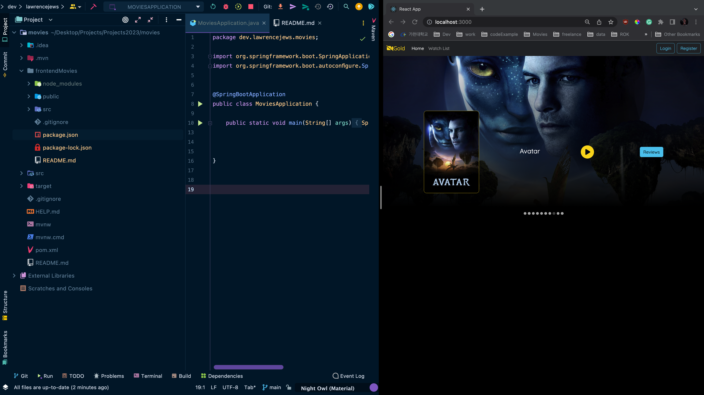

### Movies

#### Frontend
- This project was created with react-18 - spring boot backend  -- MongoDB database.
- The connection between React and Java Spring API was made possible by CORS since they run on different port.
- Start the project by running `npm install` in the root directory.
- To run `npm start`.
#### Backend
- The Database is accessible using MongoDB Atlas where a collection of json movies were uploaded.
- Run the application file to start the backend` Application.java`. OR `mvn clean install` and `mvn spring-boot:run`
- Created a database on Mongo Cloud then connected it to a java spring boot project
- Communication between MongoDB and Java was established using a `.env` file within the resources folder.
- The Java project was created with `spring initializr: Maven, spring web, lombok and spring data MongoDB`.
- API testing was done with Postman for methods:`GET, POST and Create `using a `movie.json` file uploaded to MongoDB.
- The Frontend connection was established with CORS:determine cross-origin` domain, scheme or port ` while interacting with the server.
- Controller Method CORS configuration:allows access for that specific Request method OR enable CORS for the whole controller.
- Global CORS configuration:with a config package - WebMvcConfig file for configuration where methods by default allow all origins.

 This work is licensed under a <a rel="license" href="http://creativecommons.org/licenses/by/4.0/">Creative Commons Attribution 4.0 International License</a>.